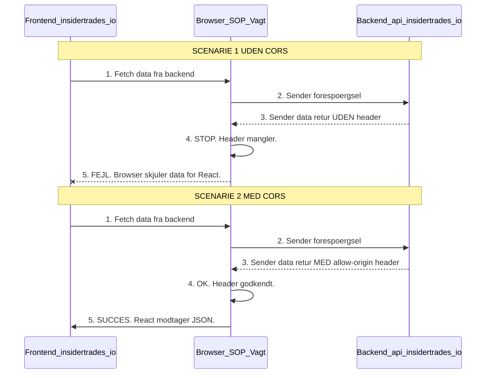

```mermaid

sequenceDiagram
    participant React as Frontend_insidertrades_io
    participant Browser as Browser_SOP_Vagt
    participant API as Backend_api_insidertrades_io

    Note over React, API: SCENARIE 1 UDEN CORS
    
    React->>Browser: 1. Fetch data fra backend
    Browser->>API: 2. Sender forespoergsel
    API-->>Browser: 3. Sender data retur UDEN header
    Browser->>Browser: 4. STOP. Header mangler.
    Browser--xReact: 5. FEJL. Browser skjuler data for React.

    Note over React, API: SCENARIE 2 MED CORS
    
    React->>Browser: 1. Fetch data fra backend
    Browser->>API: 2. Sender forespoergsel
    API-->>Browser: 3. Sender data retur MED allow-origin header
    Browser->>Browser: 4. OK. Header godkendt.
    Browser->>React: 5. SUCCES. React modtager JSON.
```