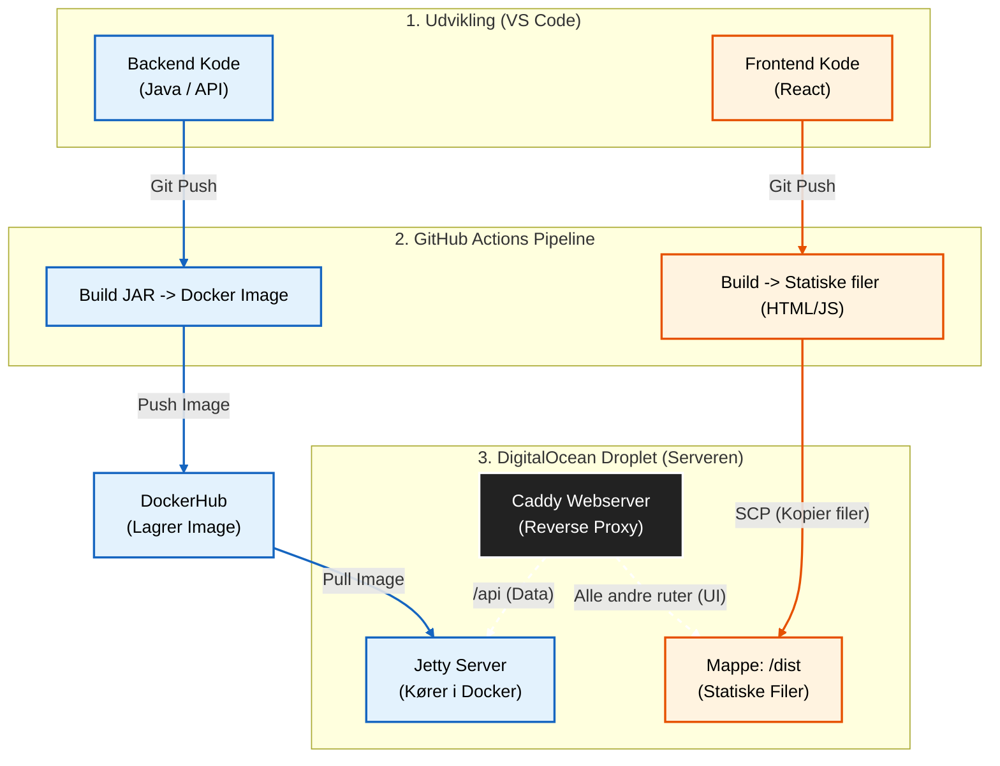

```mermaid
graph TD
    %% --- STYLING ---
    classDef be fill:#e3f2fd,stroke:#1565c0,stroke-width:2px,color:#000;
    classDef fe fill:#fff3e0,stroke:#e65100,stroke-width:2px,color:#000;
    classDef caddy fill:#222,stroke:#fff,stroke-width:2px,color:#fff;

    %% 1. UDVIKLING
    subgraph Development ["1. Udvikling (VS Code)"]
        BE_Code["Backend Kode<br/>(Java / API)"]:::be
        FE_Code["Frontend Kode<br/>(React)"]:::fe
    end

    %% 2. CI/CD
    subgraph CI_CD ["2. GitHub Actions Pipeline"]
        BE_Build["Build JAR -> Docker Image"]:::be
        FE_Build["Build -> Statiske filer (HTML/JS)"]:::fe
    end

    %% 3. TRANSPORT
    DockerHub["DockerHub<br/>(Lagrer Image)"]:::be

    %% 4. SERVER (Her er ændringen!)
    subgraph Droplet ["3. DigitalOcean Droplet (Serveren)"]
        %% Denne linje vender tyngdekraften om i denne boks:
        direction BT
        
        %% Nu vil Caddy (som sender pile) ligge i BUNDEN
        Caddy["Caddy Webserver<br/>(Reverse Proxy)"]:::caddy

        %% Og modtagerne vil ligge i TOPPEN
        Jetty["Jetty Server<br/>(Kører i Docker)"]:::be
        Dist["Mappe: /dist<br/>(Statiske Filer)"]:::fe
    end

    %% --- FORBINDELSER ---

    %% Backend Flow
    BE_Code -->|"Git Push"| BE_Build
    BE_Build -->|"Push Image"| DockerHub
    DockerHub -->|"Pull Image"| Jetty

    %% Frontend Flow
    FE_Code -->|"Git Push"| FE_Build
    FE_Build -->|"SCP (Kopier filer)"| Dist

    %% Caddy Flow (Nu peger pilene OPAD visuelt)
    Caddy -.->|"/api (Data)"| Jetty
    Caddy -.->|"Alle andre ruter (UI)"| Dist

    %% Styling
    linkStyle 0,1,2 stroke:#1565c0,stroke-width:2px;
    linkStyle 3,4 stroke:#e65100,stroke-width:2px;
    linkStyle 5,6 stroke:#fff,stroke-width:2px,stroke-dasharray: 5 5;
```