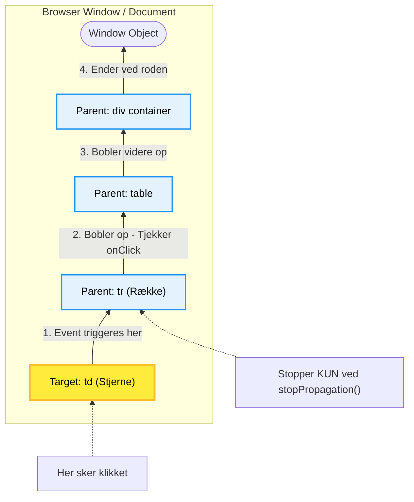

```mermaid
graph BT
    %% Kommentaren skal stå på sin egen linje
    
    subgraph Browser_Window ["Browser Window / Document"]
        direction BT
        
        div["Parent: div container"]
        tableNode["Parent: table"]
        trNode["Parent: tr (Række)"]
        tdNode["Target: td (Stjerne)"]
        window([Window Object])

        %% Boble-vejen
        tdNode -->|1. Event triggeres her| trNode
        trNode -->|2. Bobler op - Tjekker onClick| tableNode
        tableNode -->|3. Bobler videre op| div
        div -->|4. Ender ved roden| window
    end

    %% Styling
    classDef target fill:#ffeb3b,stroke:#fbc02d,stroke-width:3px,color:#000;
    classDef path fill:#e3f2fd,stroke:#2196f3,stroke-width:2px,color:#000;
    
    class tdNode target;
    class trNode,tableNode,div path;

    %% Forklaring
    Note1[Her sker klikket] -.-> tdNode
    Note2["Stopper KUN ved stopPropagation()"] -.-> trNode

```