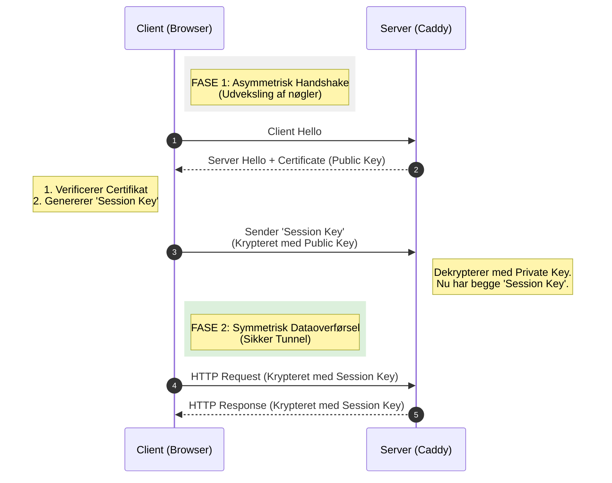

```mermaid
sequenceDiagram
    autonumber
    %% Styling for et professionelt, rent look
    rect rgb(240, 240, 240)
    note right of C: FASE 1: Asymmetrisk Handshake<br/>(Udveksling af nøgler)
    end
    
    participant C as Client (Browser)
    participant S as Server (Caddy)

    %% Step 1
    C->>S: Client Hello
    
    %% Step 2
    S-->>C: Server Hello + Certificate (Public Key)
    
    %% Step 3 - Intern proces
    note left of C: 1. Verificerer Certifikat<br/>2. Genererer 'Session Key'

    %% Step 4
    C->>S: Sender 'Session Key'<br/>(Krypteret med Public Key)
    
    %% Step 5 - Intern proces
    note right of S: Dekrypterer med Private Key.<br/>Nu har begge 'Session Key'.

    %% FASE SKIFT
    rect rgb(220, 240, 220)
    note right of C: FASE 2: Symmetrisk Dataoverførsel<br/>(Sikker Tunnel)
    end

    %% Step 6
    C->>S: HTTP Request (Krypteret med Session Key)

    %% Step 7
    S-->>C: HTTP Response (Krypteret med Session Key)

```