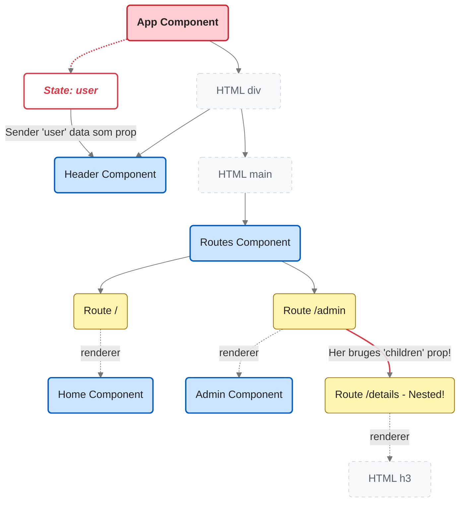

```mermaid
graph TD
    %% --- STYLING START ---
    %% Vi definerer en moderne, ren farvepalette med HØJ kontrast
    %% color:#222 sikrer mørk tekst, uanset din VS Code settings.
    
    %% App (Root) - Rødlig nuance
    classDef appFill fill:#ffcdd2,stroke:#cb2431,stroke-width:2px,color:#222,font-weight:bold,rx:5,ry:5;
    
    %% HTML elementer - Neutral lysegrå
    classDef htmlFill fill:#f6f8fa,stroke:#d1d5da,stroke-width:1px,stroke-dasharray: 5 5,color:#586069,rx:5,ry:5;
    
    %% React Komponenter - Ren blå
    classDef compFill fill:#cce5ff,stroke:#005cc5,stroke-width:2px,color:#222,rx:5,ry:5;
    
    %% Routes - Varm gul/orange
    classDef routeFill fill:#fff5b1,stroke:#9a6700,stroke-width:1px,color:#222,rx:5,ry:5;
    
    %% Data/State - Hvid boks med rød tekst der popper
    classDef dataProp fill:#fff,stroke:#d73a49,stroke-width:2px,color:#d73a49,font-style:italic,font-weight:bold,rx:5,ry:5;

    %% Standard link stil (gør pilene tydeligere)
    linkStyle default stroke:#777,stroke-width:1px;
    %% --- STYLING SLUT ---


    %% Node definitions (Kasserne)
    App(App Component):::appFill
    DivHTML[HTML div]:::htmlFill
    Header(Header Component):::compFill
    MainHTML[HTML main]:::htmlFill
    Routes(Routes Component):::compFill
    RouteHome(Route /):::routeFill
    Home(Home Component):::compFill
    RouteAdmin(Route /admin):::routeFill
    Admin(Admin Component):::compFill
    RouteDetails(Route /details - Nested!):::routeFill
    H3HTML[HTML h3]:::htmlFill

    %% Hierarchy connections (Pilene)
    App --> DivHTML
    DivHTML --> Header
    DivHTML --> MainHTML
    MainHTML --> Routes

    Routes --> RouteHome
    RouteHome -.->|renderer| Home

    Routes --> RouteAdmin
    RouteAdmin -.->|renderer| Admin

    %% The special 'children' nesting in Admin route
    RouteAdmin -- "Her bruges 'children' prop!" --> RouteDetails
    RouteDetails -.->|renderer| H3HTML

    %% Data flow (Props) - Not hierarchy!
    UserState[State: user]:::dataProp
    App -.-> UserState
    UserState -- "Sender 'user' data som prop" --> Header
    
    %% Styling af de specifikke røde pile
    linkStyle 8,10 stroke:#d73a49,stroke-width:2px,fill:none;
```