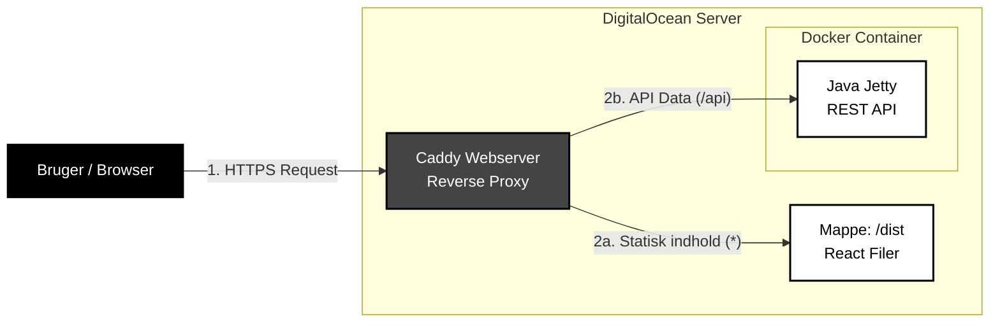

```mermaid

graph LR
    %% --- STYLING (Clean & Professional) ---
    classDef client fill:#000,stroke:#000,color:#fff,stroke-width:2px;
    classDef proxy fill:#444,stroke:#000,color:#fff,stroke-width:2px;
    classDef target fill:#fff,stroke:#000,color:#000,stroke-width:2px;
    classDef container fill:#fff,stroke:#000,color:#000,stroke-width:2px,stroke-dasharray: 5 5;

    %% 1. CLIENT SIDE (VENSTRE)
    User[Bruger / Browser]:::client

    %% 2. SERVER SIDE (HØJRE)
    subgraph Droplet [DigitalOcean Server]
        direction LR

        %% Entry Point
        Caddy[Caddy Webserver<br>Reverse Proxy]:::proxy

        %% Destination A: Frontend
        Frontend[Mappe: /dist<br>React Filer]:::target

        %% Destination B: Backend
        subgraph Docker [Docker Container]
            Backend[Java Jetty<br>REST API]:::target
        end
    end

    %% --- FLOW ---
    
    %% Step 1: Request ind
    User -- "1. HTTPS Request" --> Caddy

    %% Step 2: Fordeling
    Caddy -- "2a. Statisk indhold (*)" --> Frontend
    Caddy -- "2b. API Data (/api)" --> Backend
```